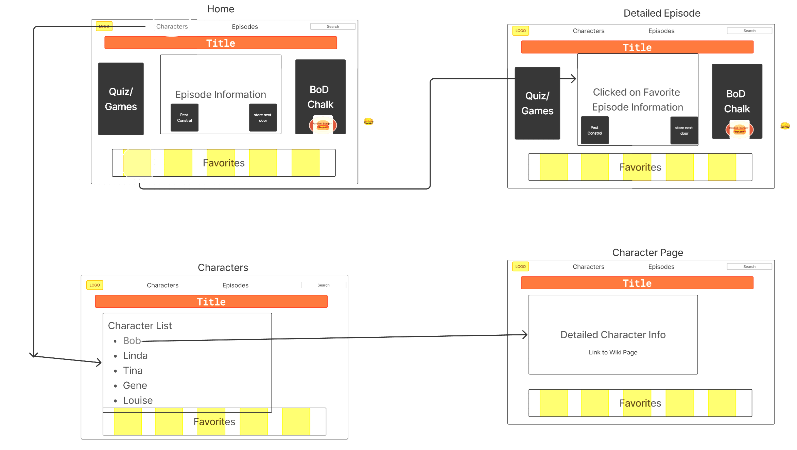

# SDI Project 2 - Bob's Burgers Fan Page

This app is intended to serve as a one-stop shop for fans of the show Bob's Burgers. The app pulls from the Bob's Burgers API and allows users to:

- Curate a list of favorite episodes
- Search for details on specific characters
- Display a random Burger of the Day, with brief correlating episode information
- View Pest Control truck jokes
- View Store-Next-Door jokes

## How To Use

This app only runs locally and requires the user to fork and clone down the repository. Once cloned down, the user will need to install the npm packages to use the command ```npm install``` and then moving into the directory run the command ```npm run dev```.

### Wire Frame concept

    